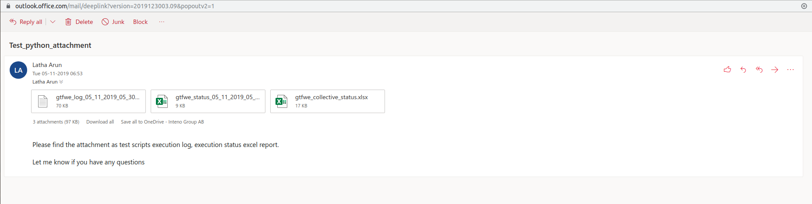

## Process Automation

### Description

gtfw_process_automation.py, is a python script implemented to automate the process of execution, to analyze log, generate and report status in excel sheet and also send email with report and log attachment. 

This can be used to analyze features functioning on different platforms of Gateways with each releases.

### Modules Installed

xlsxwriter  - creating Excel XLSX files

openpyxl  - read/write Excel 2010 xlsx files

smtplib - Secure SMTP 

### Implemented below script

- gtfwe_process_automation.py 

### Implemented following steps in gtfwe_process_automation.py :

- Implement test scripts in python which generates log in text format (Pre-condition)
- Schedule cron job to trigger daily execution of test scripts (Pre-condition)
  - crontab -e

```bash
MAILTO="latha.arun@iopsys.eu"

30 17 * * 1-5 ROOT_DIR_TEST="/home/latha/python-auto-test/gtfwe/" python3  /home/latha/python-auto-test/gtfwe/tests/pure/functional/gtfwe_process_automation.py
```

- Configure ssmtp.conf
  - sudo vi /etc/ssmtp/ssmtp.conf

```bash
#
# Config file for sSMTP sendmail
#
# The person who gets all mail for userids < 1000
# Make this empty to disable rewriting.
#root=postmaster
root=latha.arun@iopsys.eu

# The place where the mail goes. The actual machine name is required no
# MX records are consulted. Commonly mailhosts are named mail.domain.com
mailhub=YYYYYYYYYYYYYYY

# Where will the mail seem to come from?
rewriteDomain=iopsys.eu

# The full hostname
hostname=XXXXX

# Are users allowed to set their own From: address?
# YES - Allow the user to specify their own From: address
# NO - Use the system generated From: address
FromLineOverride=YES
#
UseTLS=Yes
UseSTARTTLS=Yes
# Username/Password
AuthUser=latha.arun@iopsys.eu
AuthPass=*******

```

- Executes test scripts exists under function directory

- Creates below folder structure, if folders doesn't exists already

```bash
├── Analysis
│   ├── Execution_Logs       (all generated execution logs saves here)
│   └── Reports
│       ├── Collective_Reports   (all created collective excel report saves here)
│       └── Indivisual_Reports   (all created indivisual excel report saves here)
```

- Generates all tests execution log with current date and time

- Analyses the generated log and creates status reports in excel sheet

- Creates 2 excel status reports
  - Individual status report with analyzed data
  - Collective status report with analyzed data in appended format

- Send email with attachment as execution log and excel status reports

```bash
├── Analysis
   ├── Execution_Logs
   │   ├── gtfwe_log_01_11_2019_05_30_01.log
   │   ├── gtfwe_log_05_11_2019_05_30_02.log
   └── Reports
       ├── Collective_Reports
       │   └── gtfwe_collective_status.xlsx
       └── Indivisual_Reports
           ├── gtfwe_status_01_11_2019_05_30_01.xlsx
           ├── gtfwe_status_05_11_2019_05_30_02.xlsx
```

- Sample image as email attachment with log and excel status reports


